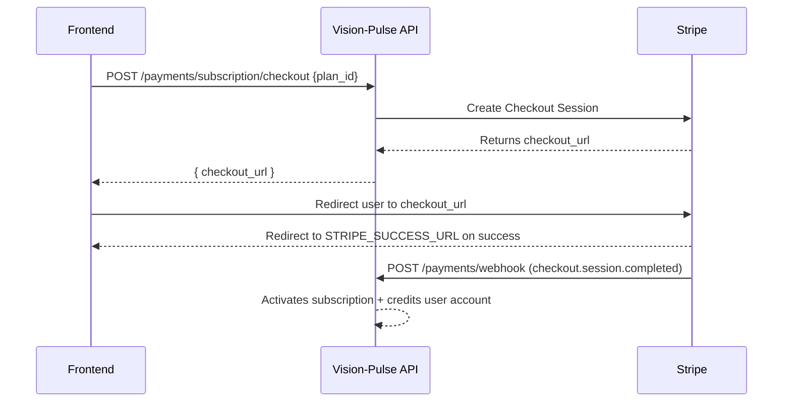

# Vision-Pulse — Stripe Integration Guide
> For Frontend Developers

---

## How It Works (Big Picture)

Vision-Pulse uses **Stripe Checkout** to handle subscription payments. The frontend never touches a card number directly — it redirects the user to a Stripe-hosted page to complete payment, then Stripe notifies our backend via **webhooks** to activate the subscription.



---

## Step-by-Step Flow

### 1. User selects a plan
The frontend calls `GET /subscriptions/` to list available plans and display them in the UI.

### 2. User clicks "Subscribe"
Call the checkout endpoint with the selected plan's `id`:

```http
POST /api/v1/payments/subscription/checkout
Authorization: Bearer <jwt_token>
Content-Type: application/json

{
  "plan_id": 2
}
```

**Response:**
```json
{
  "checkout_url": "https://checkout.stripe.com/pay/cs_test_..."
}
```

### 3. Redirect the user
```js
window.location.href = response.checkout_url;
```
Stripe handles the entire payment UX. No card form needed on your side.

### 4. After payment — handle the redirect
Stripe redirects the user back to your app at the `STRIPE_SUCCESS_URL` (configured in the backend env). This URL will include a `?session_id=cs_test_...` query parameter — **you can safely ignore it**. The subscription is activated asynchronously via webhook, not by this redirect.

```
http://yourapp.com/subscription/success?session_id=cs_test_...
```

**On the success page**, display a "Processing your subscription..." state and poll `GET /payments/subscription/me` until it returns an active subscription (usually under 2 seconds).

> [!IMPORTANT]
> Do NOT assume the subscription is active the instant the user lands on the success page. Always verify via the API.

### 5. On cancel
If the user exits Stripe Checkout, they land on `STRIPE_CANCEL_URL`:

```
http://yourapp.com/subscription/cancel
```

Show a "Payment cancelled" message and let them try again.

---

## API Endpoints Reference

| Method | Path | Auth | Description |
|--------|------|------|-------------|
| `GET` | `/api/v1/subscriptions/` | Public | List all active subscription plans |
| `GET` | `/api/v1/subscriptions/{plan_id}` | Public | Get a single plan's details |
| `POST` | `/api/v1/payments/subscription/checkout` | 🔐 JWT | Create a Stripe Checkout Session |
| `GET` | `/api/v1/payments/subscription/me` | 🔐 JWT | Get the current user's active subscription |
| `DELETE` | `/api/v1/payments/subscription/cancel` | 🔐 JWT | Cancel subscription at period end |
| `POST` | `/api/v1/payments/webhook` | ❌ No auth (Stripe signs the payload) | Stripe webhook receiver — **never call this yourself** |

---

## Subscription Object (`GET /payments/subscription/me`)

```json
{
  "id": 14,
  "user_id": 3,
  "plan_id": 2,
  "stripe_subscription_id": "sub_1ABC...",
  "stripe_customer_id": "cus_1XYZ...",
  "start_date": "2026-04-25T02:00:00",
  "end_date": "2026-05-25T02:00:00",
  "renewal_date": "2026-05-25T02:00:00",
  "status": "active",
  "created_at": "2026-04-25T02:00:00",
  "plan": {
    "id": 2,
    "name": "Pro",
    "monthly_price": 29.99,
    "monthly_credits": 5000,
    "video_limit_per_month": 50,
    ...
  }
}
```

---

## Subscription Statuses

The `status` field on a user's subscription can be one of:

| Status | Meaning | What to show the user |
|--------|---------|----------------------|
| `active` | All good, subscription is current | Normal UI |
| `past_due` | Renewal charge failed, Stripe is retrying | ⚠️ "Payment failed — please update your payment method" |
| `cancelled` | User cancelled — access until `end_date` | "Subscription ends on [date]" |
| `expired` | Subscription fully ended | "Renew your plan" / paywall |

> [!WARNING]
> A `past_due` user still has access. Do **not** lock them out. Show a persistent banner prompting them to update their card on Stripe. (A "Manage Billing" portal link can be added later via Stripe Customer Portal API.)

---

## Webhook Events Handled (Backend Only)

You don't interact with these — they're received server-side automatically. For awareness:

| Stripe Event | What Happens |
|---|---|
| `checkout.session.completed` | Subscription activated in DB, credits added to user account |
| `invoice.paid` | Monthly renewal: credits re-added, `end_date` extended |
| `invoice.payment_failed` | Subscription marked `past_due` |
| `customer.subscription.deleted` | Subscription marked `expired` |

---

## The Credit System

When a user subscribes, their account is credited with the plan's `monthly_credits`. These credits are what power video generation. The user's current credit balance is returned in the user profile endpoint:

```http
GET /api/v1/users/me
```

```json
{
  "id": 3,
  "email": "user@example.com",
  "credits": 5000,
  ...
}
```

Credits are deducted when a video is generated and **refunded automatically if the job fails**.

---

## Environment Variables the Frontend Needs to Know About

These are configured on the **backend**, but you need the matching frontend URLs:

| Backend Variable | Your Frontend URL |
|---|---|
| `STRIPE_SUCCESS_URL` | `/subscription/success` — where Stripe redirects after payment |
| `STRIPE_CANCEL_URL` | `/subscription/cancel` — where Stripe redirects if user cancels |

Make sure these match exactly what you configure in `.env` on the backend (or what your backend developer sets on the deployment environment).

---

## Local Development / Testing

To test the full Stripe flow locally, the backend developer needs to run the **Stripe CLI** to forward webhooks:

```bash
stripe listen --forward-to localhost:8000/api/v1/payments/webhook
```

This generates a `STRIPE_WEBHOOK_SECRET` that gets set in the backend's `.env`.

You can trigger test events with:
```bash
stripe trigger checkout.session.completed
stripe trigger invoice.payment_failed
```

Use Stripe's test card `4242 4242 4242 4242` with any future expiry and CVC in the Checkout form.
